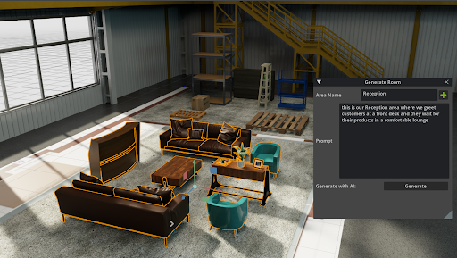
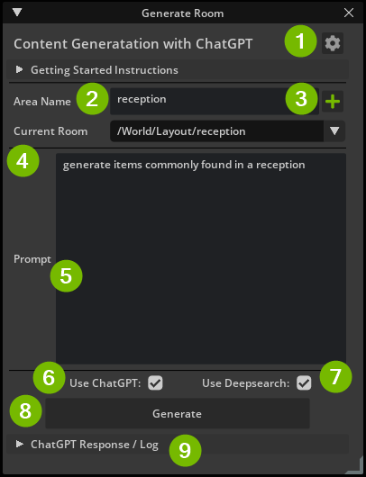
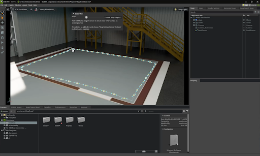
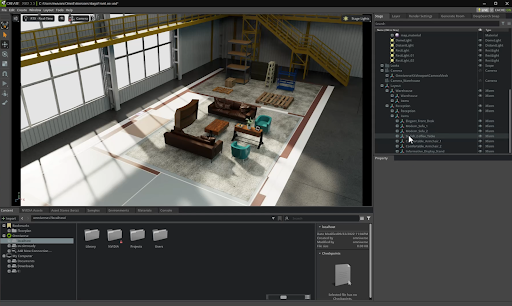
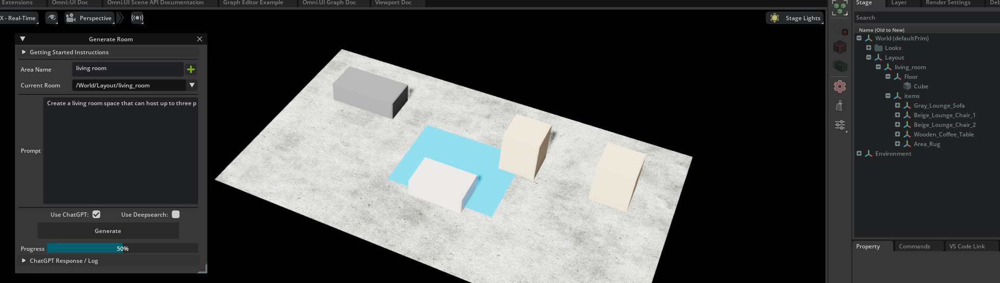

# AI Room Generator Sample Extension (omni.sample.airoomgenerator)

## Overview

The AI Room Generator Sample Extension allows users to generate 3D content to populate a room using Generative AI. The user will specify what area that defines the room and a prompt that will get passed to ChatGPT. 

> NOTE: To enable the extension you will need to have ngsearch module. By default it is already avaliable in Omniverse USD Composer. If using Omniverse Code follow these [instructions](https://docs.omniverse.nvidia.com/prod_nucleus/prod_services/services/deepsearch/client/using_deepsearch_ui.html#using-deepsearch-beta-in-usd-composer) to get ngsearch

This Sample Extension utilizes Omniverse's [Deepsearch](https://docs.omniverse.nvidia.com/prod_nucleus/prod_services/services/deepsearch/overview.html) functionality to search for models within a nucleus server. (ENTERPRISE USERS ONLY)

## UI Overview

1. Settings (Cog Button)
    - Where the user can input their API Key from [OpenAI](https://platform.openai.com/account/api-keys)
    - Enterprise users can input their Deepsearch Enabled Nucleus Path 
2. Area Name
    - The name that will be applied to the Area once added.
3. Add Area (Plus Button)
    - With an area selected and an Area Name provided, it will remove the selected object and spawn in a cube resembling the dimensions of the selected area prim.
4. Current Room
    - By default this will be empty. As you add rooms this combo box will populate and allow you to switch between each generated room maintaining the prompt (if the room items have been generated). This allows users to adjust their prompt later for an already generated room.
5. Prompt
    - The prompt that will be sent to ChatGPT. 
    - Here is an example prompt for a reception area: 
        - "This is the room where we meet our customers. Make sure there is a set of comfortable armchairs, a sofa, and a coffee table"
6. Use ChatGPT
    - This enables the extension to call ChatGPT, otherwise it will use a default assistant prompt which will be the same every time.
7. Use Deepsearch (ENTERPRISE USERS ONLY)
    - This enables the extension to use Deepsearch
8. Generate
    - With a room selected and a prompt, this will send all the related information to ChatGPT. A progress bar will show up indicating if the response is still going.
9. ChatGPT Reponse / Log
    - Once you have hit *Generate* this collapsable frame will contain the output recieved from ChatGPT. Here you can view the JSON data or if any issues arise with ChatGPT.

## How it works

### Getting information about the 3D Scene

Everything starts with the USD scene in Omniverse. Users can easily circle an area using the Pencil tool in Omniverse or create a cube and scale it in the scene, type in the kind of room/environment they want to generate - for example, a warehouse, or a reception room - and with one click that area is created.

### Creating the Prompt for ChatGPT

The ChatGPT prompt is composed of four pieces; system input, user input example, assistant output example, and user prompt.  
Let’s start with the aspects of the prompt that tailor to the user’s scenario. This includes text that the user inputs plus data from the scene.
For example, if the user wants to create a reception room, they specify something like “This is the room where we meet our customers. Make sure there is a set of comfortable armchairs, a sofa and a coffee table”. Or, if they want to add a certain number of items they could add “make sure to include a minimum of 10 items”. 
This text is combined with scene information like the size and name of the area where we will place items as the User Prompt.

### Passing the results from ChatGPT

The items from the ChatGPT JSON response are then parsed by the extension and passed to the Omnivere DeepSearch API. DeepSearch allows users to search 3D models stored within an Omniverse Nucleus server using natural language queries. 
This means that even if we don’t know the exact file name of a model of a sofa, for example, we can retrieve it just by searching for “Comfortable Sofa” which is exactly what we got from ChatGPT.
DeepSearch understands natural language and by asking it for a “Comfortable Sofa” we get a list of items that our helpful AI librarian has decided are best suited from the selection of assets we have in our current asset library.  It is surprisingly good at this and so we often can use the first item it returns, but of course we build in choice in case the user wants to select something from the list.

### When not using Deepsearch

For those who are not Enterprise users or users that want to use greyboxing, by default as long as `use Deepsearch` is turned off the extension will generate cube of various shapes and sizes to best suit the response from ChatGPT.